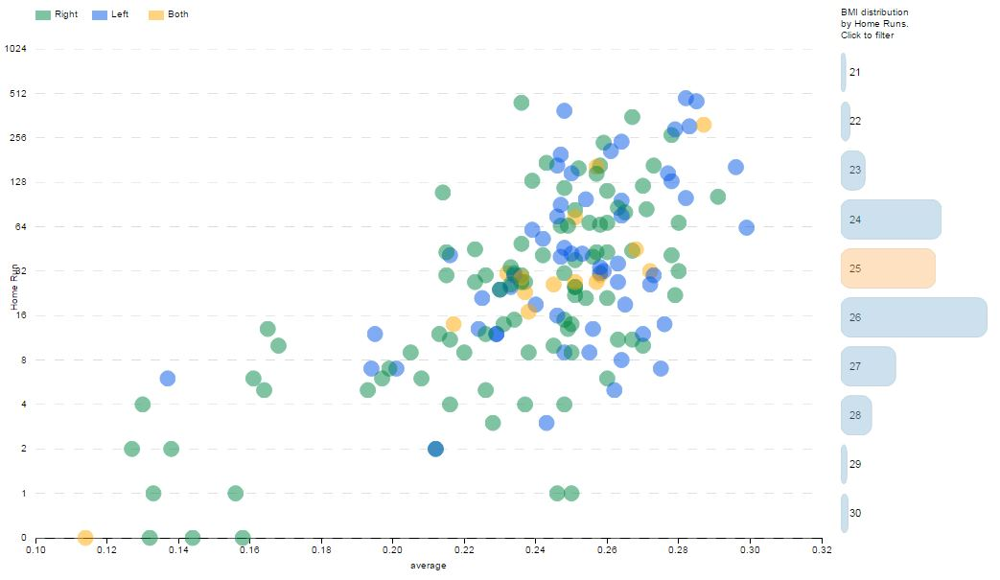
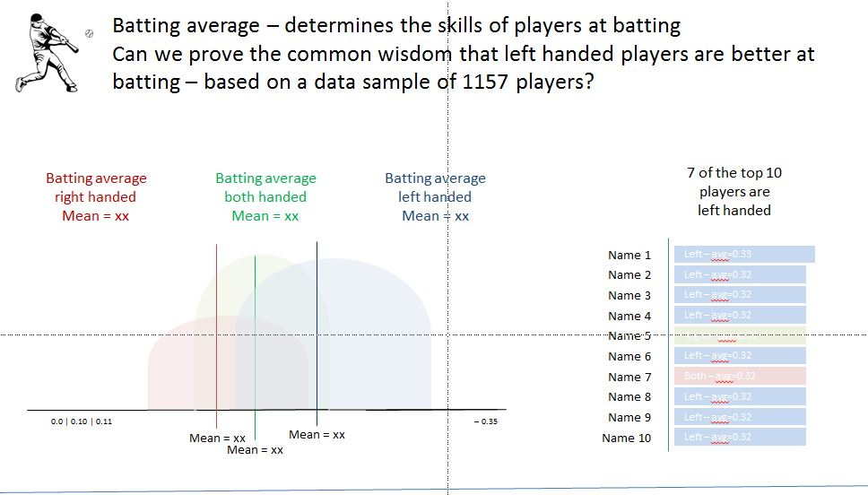
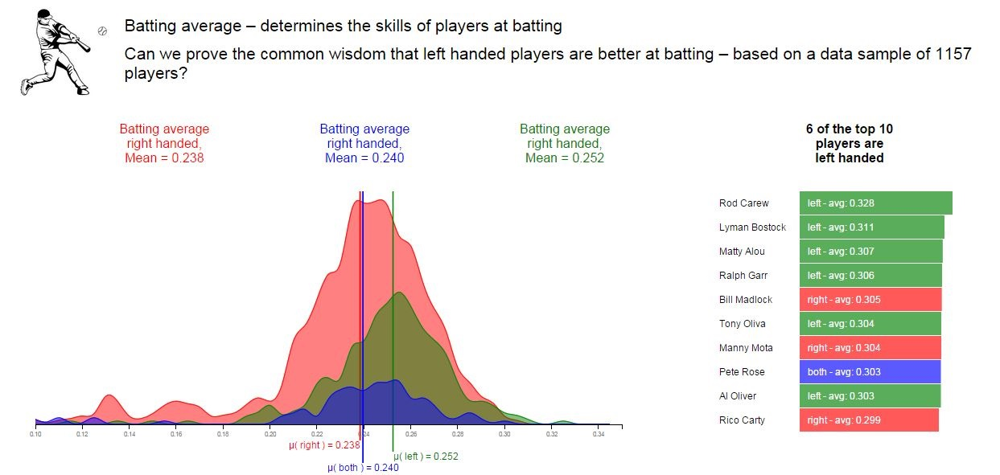

# Data Visualization: Baseball Data

--------

## Summary

I decided for the Baseball data set. This data set contains 1,157 baseball players including their handedness (right, both or left handed), height, weight, batting average, and home runs. In the appendix you see further analysis of the data in R. I looked at the features, the distributions and correlations to define a story-line.

Can we prove the common wisdom that left handed baseball players are better at batting?

- Based on our available data set of 1157 baseball players we looked at batting average score by player
- Batting average – determines the skills of players at batting and is an excellent indicator for individual performance
- In step 1 we look at the distribution by handedness for batting average and their mean value
- In step 2 we look at the Top 10 players by batting average
- **and YES** - Left handed players have the highest mean and 6 out of the Top 10 players are left handed

## Design

Attached a couple of d3.js charts / sketches to make the outlined story (see summary) explanatory.

<b>Sketch 1:</b> Introduce a category feature to explore HR by average by BMI-Index (https://en.wikipedia.org/wiki/Body_mass_index) - BMI Index did not turn out to be useful

<end>

<b>Sketch 2:</b> Look at handedness by HR and average

<end>

<b>Sketch 3:</b> Explore bubble chart, the size represents the sum of HR by category BMI, average. In addition the color represents handedness

<end>

<b>Sketch 4:</b> Use scatter plot to show players handedness on a grid of HR and average

<end>

<b>Sketch 5:</b> Use scatter plot to show players by BMI on a grid of HR and average, use color to show handedness, added animation and filter options. The current approach could not articulate a clear story line and was rejected - go for different approach and narrow done the key message

<end>

<b>Sketch 6:</b> After receiving the feedback from Udacity I decided to go for another approach - try to prove that handedness is a strong indicator for higher patting average, see sketch (build with power point) to test with audience

See different html-versions to see the evolution of the explanatory story:

- Version 1: v1_Baseball_MultipleCharts.html 
- Version 2: v2_Baseball_FinalChart.html
- Version 3: v3_Baseball_Animation.html 
- Version 4: v4_Baseball_Animation.html
- Version 5: v5_Baseball_Animation.html
- **Final version:** index.html

## Feedback

Questions I asked:

- What do you notice in the visualization?
- What relationships do you notice?
- What is the main message?
- Is there something you do not understand about the graphic or areas of improvement?

Interviewer 1 (summary key messages):

- green seems to be best - OK what is green, ahh left handed, fits to the title
- most of the players are right handed, top 4 are left handed
- Main message for me - left handed players seems to be the better at batting
- I would get rid of the horizontal grid-lines
- do not display all 3 distributions at once make it animated
- ...

Interviewer 2 (summary key messages):

- must be about baseball - based on the picture in the top left corner
- consistent coloring scheme - I like it
- red is more than green and green is more than blue, blue is both handed makes sense
- What is "µ"? ohh I see - "mean", ok colors helped me to figure that out
- Main message: left handed have the highest mean and top 6 of 10 are left handed
- make the number at the axis smaller and choose a smoother color, make the mean lines stronger
- overall I like it a lot, displaying the story in smaller junks would help to build the punch line
- ...

Interviewer 3 (summary key messages):

- Looks very professional, somehow I would trust the data, has a scientific appearance, like the consistent coloring
- OK, both and right handed people have a pretty similar mean, left handed are way better,even if there are less left handed players
- only one both handed under the Top 10, most are (green) - left handed
- Main message - I would make sure that I have enough left handed players in my baseball team
- graphic is clean, would even get rid of the x-axis, so that you have full attention on the mean, I guess nobody really cares about the exact numbers, just the relative positions
- ...

Design choices I made:

- played with different chart types. Scatter plot had the nice effect that you see the details if you mouse over a bubble, but not useful to show a distribution. So I decided for a frequency diagram to show the distribution and bar chart to display the top 10 players
- I decided to use a smoothing function to take the attention away from the audience on the edge of the distribution, since the main message is the mean
- I decided to have a consistent coloring from text to mean KPI and top ten player, so the the reader can easily see what belongs to right, left and both handed
-  I decided to add an animation, walk the reader through the key message and focus his/her attention on every step of the story. Displaying all at once caused much longer time to understand the message and make sense out of the data
-  I decide to highlight the mean value so that the reader focuses on the main message - batting average mean by handedness
-  I made the x-axis text smaller and changed color to grey, people focused on the numbers, again the main message is the relative position of the means
-  I removed y axis for the frequency charts and the grid lines since they do not add to the main message
-  I enhanced the bar size of the bar chart to be able to write the text in the bars, this made it easier for readers to associate the values to the bar
- Color choice - I decided for high contrast color, to make the 3 different population inside the baseball data set transparent

These were the main design choices I made after getting feedback. It is worth mentioning that I also received contradicting feedback, meaning some people liked it exactly in the opposite way than others. Therefore I tried to better understand why people wanted to have it in a certain way and evaluated the pros and cons to make the final design decision.

## Visualization

Final visualization - attached a picture of the final visualization. The graphic is animates and walks the reader through the story. The story should underline the key statement - "Are left handed baseball player better at batting?". The animation shows the mean for batting average by handedness (from low to high). The last chart underlines the message by showing that most of the top players in baseball are left handed.

<end>
--------

Resources - list any sources you consulted to create your visualization:

- http://dimplejs.org/advanced_examples_viewer.html?id=advanced_storyboard_control
- http://dimplejs.org/
- http://d3js.org/
- https://en.wikipedia.org/wiki/Body_mass_index
- http://bost.ocks.org/mike/
- Book: "Interactive Data Visualization for the Web", O'Reilly
- handedness: http://www.hardballtimes.com/the-advantage-of-batting-left-handed/
- Baseball: http://www.hardballtimes.com/the-advantage-of-batting-left-handed/
 
## Appendix

### Analyzing and understand the data set

The three main additions/changes I have made to the data set are:

- Data cleaning - removed player with avg=0 and HR=0
- Edit player with the same name, to distinguish them I added the initial for handedness to the name
- Introduce a new feature Body Mass Index (BMI - https://en.wikipedia.org/wiki/Body_mass_index), to combine two features into one (height, weight)

Using R to get insights into the Baseball data set:

<end>

<end>
Initial observations:

To first explore this data visually, I used the ggpair function and applied it to the data-set. This will give me quick insights on the 5 variables. The intention here is to see a quick distribution of the values.

ggpairs summary as jpeg:

<end>

