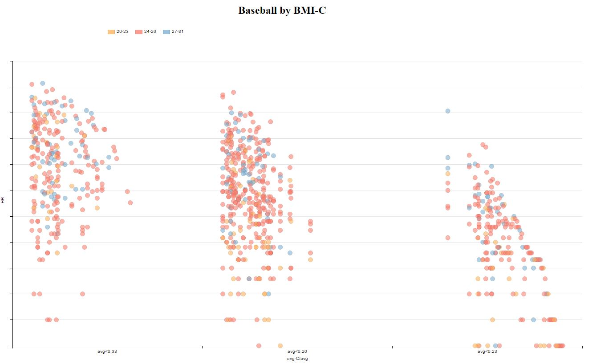
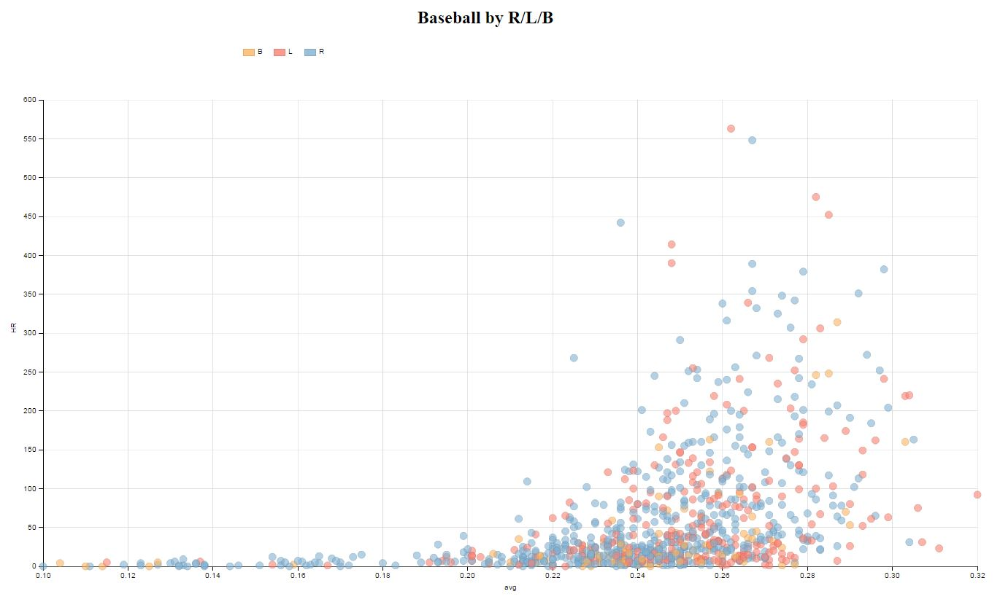
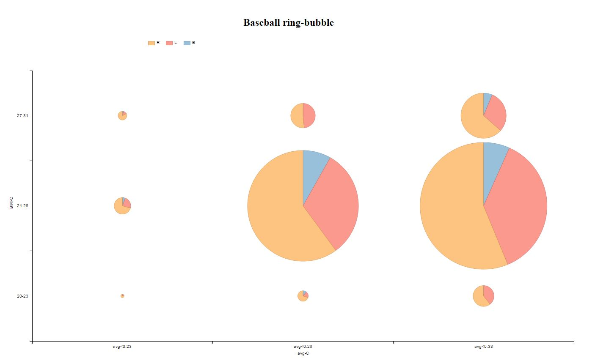
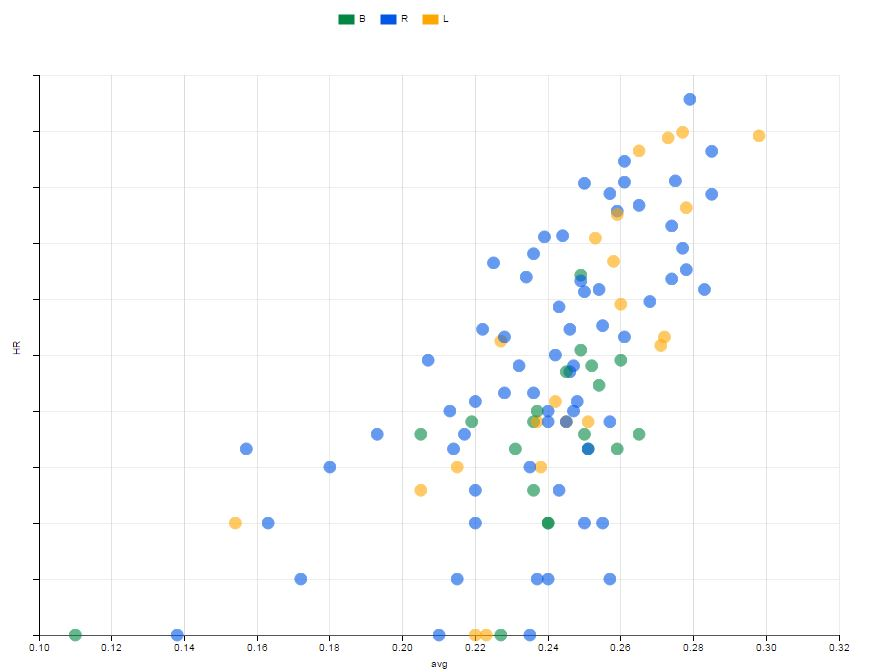
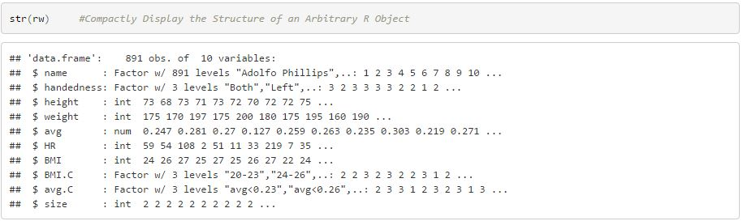
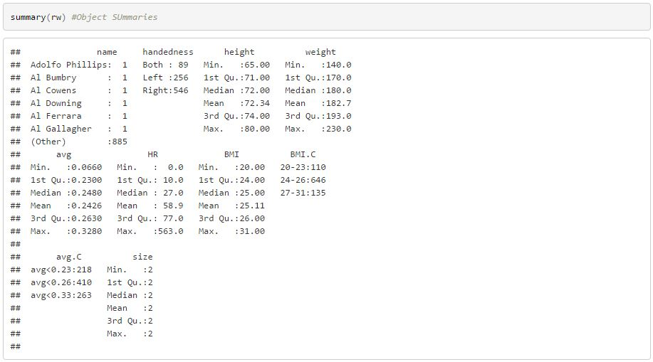
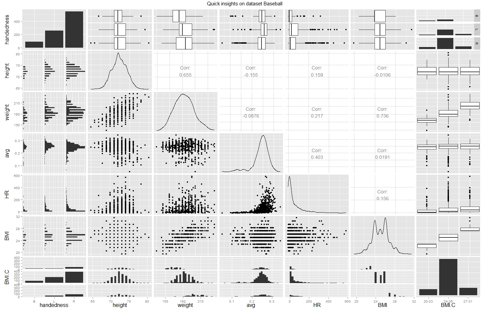

# Explore & Summarize Data: For Baseball

--------

## Summary

I decided for the Baseball data set including the basic data of 1157 baseball players. In the appendix you see further analysis of the data in R. I looked at the features, the distributions and correlations to define a story-line. The two main additions/changes I made are:

- Data cleaning - removed player with avg=0 and HR=0
- we had player with the same name, to distinguish them I added the initial for preferred hand to the name
- introduce a new feature Body Mass Index (BMI - https://en.wikipedia.org/wiki/Body_mass_index), more infos under this link

Story-lines:

- The is a high correlation between weight and height and the performance of a baseball player. Performance as measured in Home Runs and Batting average
- In addition the handedness as an influence too
- I wanted to use a nomination to explain the audience the impact of BMI and Handedness on performance metric, by showing the distribution of the players as a scatter plot
- in addition the audience can explore themselves by filtering the data and find the best players and their indicators
- decided for the scatter plot since I was mainly interested in the distribution of the baseball players by certain metric

## Design

--------

Attached my first d3.js charts to make the outlined story (see summarize) explanatory.

<b>Sketch 1:</b> Introduce a category feature to explore HR by average by BMI-Index

<end>

<b>Sketch 2:</b> Look at handedness by HR and average

<end>

<b>Sketch 3:</b> Explore bubble chart, the size represents the sum of HR by category BMI, average. In addition the color represents handedness

<end>

<b>Sketch 4:</b> Use scatterplot to show players by BMI on a grid of HR and average, use color to show handedness

<end>

Sketch 4 was the winner and will be used to further enhance the story.

Design choices:

- log 2 basis for HR and added scale numbers to legend since this is not supported in D3.js - why
- change to Google colors and use opacity to show density
- remove grid lines and reduce to minimum
- add animation and additional chart to show HR distribution by BMI support explanatory
- change text for axis and legend
- add filter options to provide exploratory capabilities
- change bubble size
- .....

See different version as to see the involvement of the explanatory story:

- Version 1:			v1_Baseball_MultipleCharts.html 
- Version 2:			v2_Baseball_FinalChart.html
- Version 3:			v3_Baseball_Animation.html 
- Version 4:			v4_Baseball_Animation.html
- **Final version:**		index.html

## Feedback

Interviewer 1 (Marvin)

Interviewer 2 (Krista)

Interviewer 3 (JF)

--------

include all feedback you received from others on your visualization from the first sketch to the final

## Visualization

Final visualization - attached a picture of the final vizuation. The grafik animates once through all BMI indicies and explains the changes in distribution of all baseball Players with the BMI category by HR, average and handedness.

<end>
--------

Resources - list any sources you consulted to create your visualization:

- http://dimplejs.org/advanced_examples_viewer.html?id=advanced_storyboard_control
- http://dimplejs.org/
- http://d3js.org/
- https://en.wikipedia.org/wiki/Body_mass_index
- Book: "Interactive Data Visualization for the Web", O'Reilly

## Appendix

### Analyzing and understand the dataset
Using R to get insights into the Baseball data set:

<end>

<end>
Initial observations:

To first explore this data visually, I'll use the ggpair function and apply it to the data-set "rw". This will give me quick insights on the 5 variables. The intention here is to see a quick distribution of the values.

ggpairs summary as jpeg:

<end>

